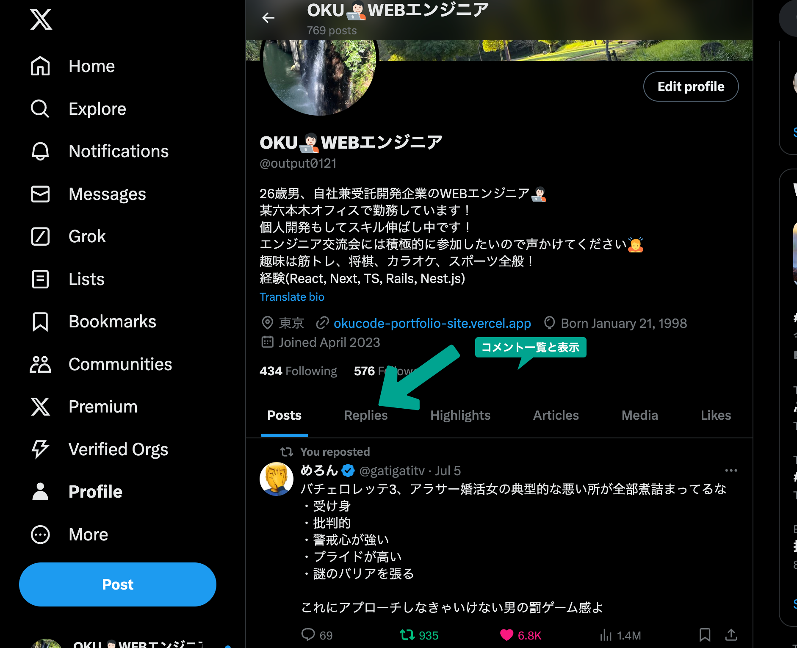

# React, TypeScript, Rails(APIモード)でXクローン　+ αを作成する。
以下のURLを参考にrails側のみdocker化する。
https://zenn.dev/dsakai07/articles/84ceb379cffbcb

フロントエンドはこれを参考に環境構築
https://qiita.com/kabosu3d/items/c6a634feafb7338793a8

## Xクローン + αの要件　(エンジニア特化型のSNSを作成するよう)
そのまま同じように作る必要はない。本家は難易度の高い実装を含んでいるため、適度に自己流にしてよい。目的は同じものを作るのではなく、フロントとバックエンドを分けた開発の流れや感覚を掴むという感じで作る。ただこの下に指定した場合はそれをやること。

- ユーザーは新規登録できる
- ユーザーはログインできる
- ユーザーはプロフィールを登録、更新できる
- プロフィールは以下の項目とする
  - ヘッダー画像
  - プロフィール画像
  - 名前
  - 自己紹介
  - 場所
  - ウェブサイト(github, qiita, 自身のポートフォリオURLの3つを登録できるように)
  - 生年月日
- ツイートを投稿できる
  - 投稿には画像を含められる
  - 投稿にはタグをつけることができる。
- 一度投稿したツイートを編集、削除はできる
- ツイートにコメントができる
- コメントは編集はできないが削除はできる
- ツイートにいいねができる
- ユーザーは他のユーザーをフォローできる
- ユーザーはフォロー解除できる
- ユーザーは以下の場合に通知を受信できる
  - 自分の投稿にいいねされたとき
  - フォローされたとき
  - ツイートにコメントがあったとき
- ユーザーは「メッセージ」機能でダイレクトメッセージをやりとりできる。2人のみやり取りを実装できれば良い。
- ユーザーはツイートをブックマークして保存できる
- ユーザーは退会できる(削除か論理削除かはどちらでも良い)

## Rails API 必ず使うgem
```ruby
gem 'devise_token_auth'        # APIエンドポイント認証
gem 'active_model_serializers' # APIのフォーマット整形
```
https://rooter.jp/programming/rails-activemodelserializers/

## ヒントやこれを学習すればいい感じになるという参考記事や動画
devise-token-authのセットアップがこれの通りにすればできる。
メール送信は含まれてないからそれは自分で調べて。
https://zenn.dev/prune/books/32a2fd62831c7f/viewer/2969b9

タグ登録機能
https://zenn.dev/shogo_matsumoto/articles/1b0c2d3232bf5f

この動画のテストは飛ばしていいので実装箇所をハンズオンでやるとよい。
axiosではなく、fetchを使っているが、それも勉強になる。(paginationでハマったら用)
https://www.youtube.com/watch?v=nKybfmmO7JU&list=PL3mtAHT_eRewtt6HPMHFB4TMxkxiEfp9N

これは任意。自分もやってない。やってできたら逆に教えて欲しい。AWSデプロイ用課題じゃないけどやってみる価値大あり。
https://zenn.dev/prune/books/28c2d690e11e45

## APIのエンドポイントの動作確認は必ずPostmanを使用すること
インストール
https://www.postman.com/downloads/
使い方
https://www.youtube.com/watch?v=a9gFPWrDky0
https://zenn.dev/nameless_sn/articles/postman_tutorial

使い方がわからない場合はclaude3.5 sonnet に聞けば教えてくれる。
```
devise-auth-tokenの新規登録のAPIをpostmanでたたいて動作確認したい。手順を詳しく教えて。
```
エンドポイントとコードをペーストした後に
```
このエンドポイントをpostmanでたたいて動作確認したい。手順を詳しく教えて。
```

## 必ず使用しなければならないreactのpackage　実務での経験を元に指定。
- axios
- yamada-ui できるだけ活用する。実務では結構UIライブラリを活用している
- react-hook-form これでフォームを作って必ずバリデーションを作るように。
https://www.youtube.com/watch?v=f1fysEKNwQA
- zod  react-hook-formとセットで使う。調べて。
- jotai 状態管理ライブラリ
recoilと似ているので概念をこのyoutubeで学ぶこと。
https://www.youtube.com/watch?v=S93hsNFmIcM

## Swaggerというものを学習しておく。実務では必須になってくる知識
https://qiita.com/yuya_sega/items/0b87e8e7d494f6fa3d69
このディレクトリにswagger.yamlがあるのでそれを参考にエンドポイント5個くらい作ってみる。
このURLかvscodeの拡張機能で確認すること
https://editor.swagger.io/

# タスク一覧

## 新規登録機能

### rails

- 認証は[devise_token_auth](https://github.com/lynndylanhurley/devise_token_auth)を使用する
(これはハマったら無理してやらなくて良い) 開発環境でメールが受信できるようにmailcatcherもしくはletter_opener_webを追加すること
  - https://hub.docker.com/r/schickling/mailcatcher/
  - https://github.com/fgrehm/letter_opener_web
- modelは`User`とする
- http://localhost:3000/api/v1/usersで新規登録できるようにすること

### react

- 新規登録画面を実装する

## ログイン機能

### rails

- [devise_token_auth](https://github.com/lynndylanhurley/devise_token_auth)の導入でログイン機能を実装する
- http://localhost:3000/api/v1/users/sign_in でログインできることを確認すること

### react

- ログイン画面を実装する
- ログイン後はツイート一覧画面表示するが、現時点では`ツイート一覧画面`とテキストだけの画面を用意してログイン後に遷移するだけでよい

## ツイート投稿機能

### rails

- ツイート投稿APIを実装する(/api/v1/posts)
- 画像を投稿できるように画像登録用のエンドポイントも実装する(/api/v1/images)

### react

- ツイート投稿フォームを実装する(tagも登録できるようにする。)
- 画像も登録できるようにする

## ツイート一覧機能

### rails

- ツイートの一覧機能を実装する(/api/v1/posts)
- 全ユーザーのツイートを表示する
- ページネーションできるようにすること


### react

- ツイートの一覧を表示できるようにする

## ツイート詳細

### rails

- ツイート詳細APIを実装する(/api/v1/posts/:id)

### react

- ツイート一覧画面からツイートをクリックするとツイート詳細画面に遷移するようにする
- ツイート詳細画面を実装する

## プロフィール画面実装

### rails

- プロフィール更新APIを実装する(/api/v1/profile)
- ユーザーごとのツイート一覧を取得できるAPIを実装する(/api/v1/users/:id)
  - 後に他の情報が取得できるようにpostsキーにpostsの配列をいれるようにすること

### reacrt

- プロフィール画面とプロフィール更新画面の2つを実装する
- プロフィール更新画面は本家X同様モーダルで実装する(yanada-uiのmodalコンポーネントを使用)
- プロフィール画面では自分のツイート一覧を表示する

## ツイート削除、編集機能

### rails
ヒント
${id}は現在ログインしているユーザーのidをバックエンドに送れば良い

- ツイート削除APIを実装する(/api/v1/posts/${id}) delete
- ツイート更新APIを実装する(/api/v1/posts/${id}) update

### react

- プロフィール画面の自分のツイート一覧から削除、編集できるようにする。
- タイムラインでも自分の投稿だったら編集、削除できるようにしても良い。...のアイコンにモーダル表示でやっても良い。任意

## コメント機能

### rails

- ツイートのコメントAPIを実装する(/api/v1/comments)

### react

- ツイート一覧画面からコメントをできるようにする
- コメントは本家X同様モーダルで実装する(yanada-uiのmodalコンポーネントを使用)

## コメント一覧機能

### rails

- コメント一覧APIを実装する(/api/v1/posts/:post_id/comments)

### react

- ツイートを押すとツイート詳細画面に遷移し、該当ツイートとコメント一覧を表示する

## rails(コメント削除API)

- コメントの削除機能を実装する(/api/v1/comments/${id})

## react(コメント一覧画面)

- プロフィール画面で自分のコメント一覧を表示する



- 削除もできるようにすること

## いいね

### rails

- いいねAPIを実装する(/api/v1/posts/:post_id/favorites)
- ツイート一覧APIを拡張していいね数を返すようにする

### react

- ツイート一覧画面からいいねボタンを押していいねできるようにする
- いいね数を表示する

## フォロー

### rails

- フォローAPIを実装する(/api/v1/users/:user_id/follow)

### react

- ツイート一覧画面からユーザー名をクリックするとプロフィール画面に遷移するようにする
- プロフィール画面でフォローできるようにする
- フォロー後はフォローボタンを`フォロー中`に変更する

## フォロー解除

### rails

- アンフォローAPIを実装する(/api/v1/users/:user_id/unfollow)

### react

- プロフィール画面でフォロー解除できるようにする
- フォロー解除後は`フォロー`にボタンを変更する

## 通知

### rails

- いいね、フォロー、コメントがあったときに通知テーブルに通知を書き込む
- 通知一覧APIを実装する(/api/v1/notifications)

### react

- 通知の一覧を表示できるようにする

## ダイレクトメッセージ

### rails

- グループ作成APIを実装する(/api/v1/groups)
- グループでメッセージを投稿できるようにする(/api/v1/groups/:group_id/messages)
- グループ内のメッセージを参照できるようにメッセージ一覧APIを実装する(/api/v1/:group_id/messages)
- グループの一覧を参照できるAPIを実装する(/api/v1/groups)

### react

- サイドバーからメッセージ画面に遷移できるようにする
- 遷移後はグループ一覧画面に遷移する
- 任意のグループを選択するとグループ詳細画面が表示され、メッセージの表示、投稿ができるようにする

## ブックマーク

### rails

- ブックマークAPIを実装する(/api/v1/bookmarks)
- ブックマーク一覧APIを実装する(/api/v1/bookmarks)

### react

- ツイート一覧画面からツイートをブックマークできるようにする

## 退会

### rails

- 退会のAPIが動作することを確認する(/api/v1/users/:user_id)
論理削除でも物理削除でもどちらでも良い。
(DELETE メソッド)

